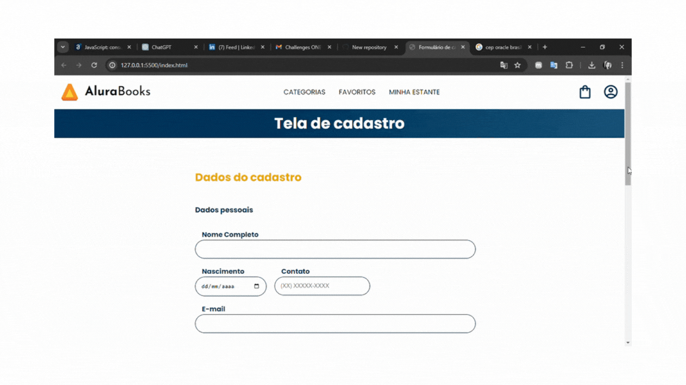

# Consumindo e Tratando Dados de uma API com JavaScript

Projeto desenvolvido com base no curso "JavaScript: Consumindo e tratando dados de uma API", oferecido pela Alura em parceria com a Oracle Next Education - ONE T6. O objetivo deste projeto é aplicar os conhecimentos adquiridos no curso, especialmente em relação à assincronicidade, promises e manipulação de formulários.

## Funcionalidades

- Entendimento do JavaScript assíncrono
- Consumo da API do ViaCEP com o fetch API
- Utilização de callbacks e promises
- Uso de async await para funções assíncronas
- Tratamento de erros de requisição retornados da API
- Transformação de uma página de formulário estática em dinâmica

## Demonstração

